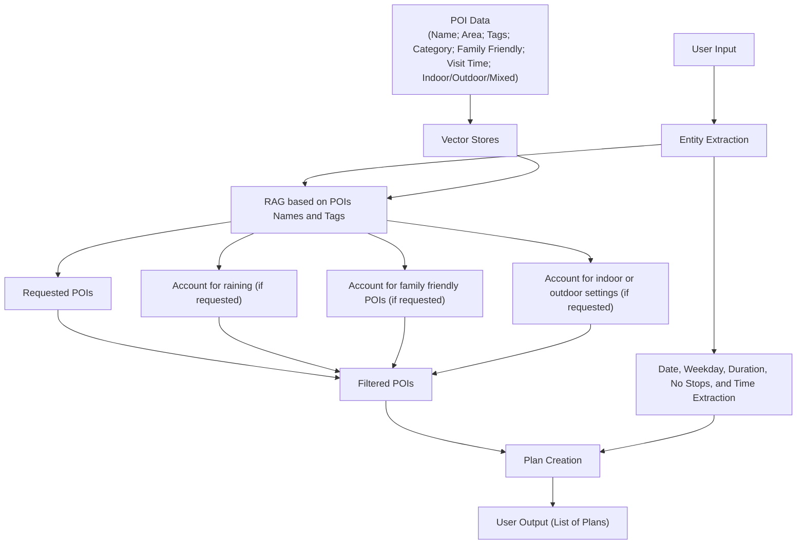

# POI_Plan
Plan a trip in Corfu based on a list of POIs and user instructions. The project uses RAG, vector databases, weather API and a planning system to find suitable POIs and create plans.

# Technologies
Streamlit for Application
ChromaDB for vector databases
LangChain for embeddings and LLM integration
OLLAMA models

# Install Requirements
```bash
pip install -r requirements.txt
```

# OLLAMA
You need ollama to run the application
Two models were used:
```bash
ollama pull llama3.2:3b 
ollama pull nomic-embed-text
```

# Application
After installing the above requirements, you can run the streamlit application.
```bash
streamlit run main.py
```


# Flow

